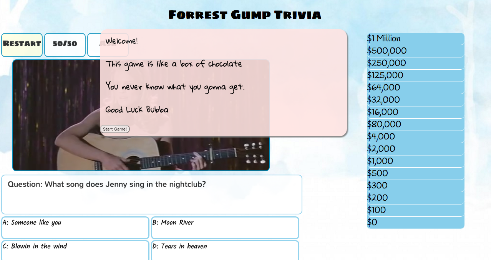

#Welcome to "The Ultimate Forrest Gump Movie Trivia"!

####I built this project in a one week sprint with the skills that I learned in the first two weeks of the web development course. I was able to build an interactive quiz on Forrest Gump movie using HTML, CSS, JavaScript and jQuery. I chose this project because I wanted to learn how to make a fun interactive quiz for my trainees when I was working at my previous job as a training coordinator. I sympathized with my trainees when they have to memorize hundreds of codes and the standard procedures to pass the management exam. It was one of my motivations to learn programming and create better solutions.

##Rules:
####There are 15 questions.
####Each question is presented in multiple choice format. Only one is the correct answer.
####There are two 'lifelines'. Each lifeline can only be used once.
#####(1) 50/50	The computer will randomly remove two incorrect answers.
#####(2) Ask your best friend *Google*. The current question will be automatically entered in the google search field as the key words.

###Here are the levels, inspired by TV show "Who Wants to be a Millionaire":
#####Q15-$1 Million
#####Q14-$500,000
#####Q13-$250,000
#####Q12-$125,000
#####Q11-$64,000
#####Q10-32,000
#####Q9-$16,000
#####Q8-$8,000
#####Q7-$4,000
#####Q6-$2,000
#####Q5-$1,000
#####Q4-$500
#####Q3-$300
#####Q2-$200
#####Q1-$100

##Lists and explanations of the technologies used

###HTML
###CSS
###JavaScript
###jQuery
